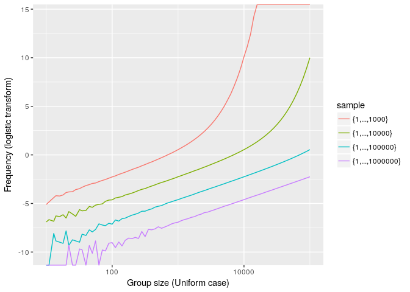

Birthday Paradox
================
Arthur Charpentier & Baptiste Coulmont
July 2017

``` r
library(stringr)
library(lubridate)
```

    ## 
    ## Attaching package: 'lubridate'

    ## The following object is masked from 'package:base':
    ## 
    ##     date

``` r
library(plyr)
```

    ## 
    ## Attaching package: 'plyr'

    ## The following object is masked from 'package:lubridate':
    ## 
    ##     here

``` r
library(data.table)
```

    ## 
    ## Attaching package: 'data.table'

    ## The following objects are masked from 'package:lubridate':
    ## 
    ##     hour, isoweek, mday, minute, month, quarter, second, wday,
    ##     week, yday, year

``` r
library(LaF)
```

Computations here can be related to the "*birthday paradox*". It is called a paradox since in a group of 25 people (which is rather small), there are more than 50% chance to have two person celebrating their birthday on the same day. Note that an important assumption when computing those probabilities is that birthdays are supposed to be **uniformly distributed over the year**.

Among *n* people the probability to have at least two persons celebrating their birthday on the same day
$$
1-\\frac{365!}{365^n(365-n)!}
$$
 One can use Monte Carlo simulations to approximate that fraction

``` r
probabilite=function(n,ns=1e4){
 P=rep(NA,ns)
 for(i in 1:ns) P[i]=max(table(sample(1:365,size=n,replace=TRUE)))>1
 mean(P)
}
P=Vectorize(probabilite)(2:60)
base=data.frame(Taille=2:60,probabilite=P)
library(ggplot2)
g1=ggplot(base,aes(Taille, probabilite))+geom_line()
g1
```


Another (possibly) interesting quantity is the *proportion of people having an alter-ego*, i.e. some else among the *n* − 1 remaining people, celebrating his or her birthday on the same day,

``` r
proportion=function(n,ns=1e3){
 P=rep(NA,ns)
 for(i in 1:ns){
   T=table(sample(1:365,size=n,replace=TRUE))
   P[i]=1-sum(T==1)/n
 }
 mean(P)
}
n=seq(10,1000,by=10)
P=Vectorize(proportion)(n)
base=data.frame(Taille=n,probabilite=P)
library(ggplot2)
g2=ggplot(base,aes(Taille, probabilite))+geom_line()
g2
```


Another visualisation of that probability might be obtained consideringthe logarithm of the *odds-ratio*

``` r
base=data.frame(Taille=n,oddsratio=P/(1-P))
library(ggplot2)
g3=ggplot(base,aes(Taille, oddsratio))+geom_line()+scale_x_log10()+scale_y_log10()
g3
```


or a *probit* transform

``` r
base=data.frame(Taille=n,probit=qnorm(P))
library(ggplot2)
g4=ggplot(base,aes(Taille, probit))+geom_line()+scale_x_log10()
g4
```


Assume now, instead of a uniform distribution, a Zipf/Power/Pareto distribution, over the year

``` r
u =1:365
p1=u^0/(sum(u^0))
a=1.00001
p2=u^a/(sum(u^a))
base2=data.frame(x=c(u,u),y=c(p1,p2),g=c(rep("uniform",365),rep("non uniforn",365)))
g5=ggplot(base2,aes(x, y, group=g, color=g))+geom_line()+ylab("Probability")
g5
```


Proportion of peple with an alter-ego withing *n* people is now given by the dotted line

``` r
proportion2=function(n,ns=1e3){
 P=rep(NA,ns)
 for(i in 1:ns){
   T=table(sample(1:365,size=n,replace=TRUE,prob=p2))
   P[i]=1-sum(T==1)/n
 }
 mean(P)
}
n=seq(10,1000,by=10)
P2=Vectorize(proportion2)(n)
base2=data.frame(Taille=n,probabilite=P2)
library(ggplot2)
g2+geom_line(aes(Taille, probabilite),data=base2,linetype=2)
```


Again, it is possible to consider the logarithm of the *odds-ratio*, as a function of the group size, *n*,

``` r
base2=data.frame(Taille=n,oddsratio=(P2/(1-P2)))
g3+geom_line(aes(Taille, oddsratio),data=base2,linetype=2)
```


or a *probit* tranform,

``` r
base2=data.frame(Taille=n,probit=qnorm(P2))
g4+geom_line(aes(Taille, probit),data=base2,linetype=2)
```


Consider now a more general problem, with *k* objects (names in our article) instead of 365 days : consider now some {*x*<sub>1</sub>, ⋯, *x*<sub>*k*</sub>}, with a uniform distribution.

``` r
PROPORTION=function(taille){
 nt = 1000
 i  = sample(1:nt,size=taille,replace=TRUE)
 X=table(i)
 proportion1= sum(X[X>1])/taille
 nt = 10000
 i  = sample(1:nt,size=taille,replace=TRUE)
 X=table(i)
 proportion2= sum(X[X>1])/taille
 nt = 100000
 i  = sample(1:nt,size=taille,replace=TRUE)
 X=table(i)
 proportion3= sum(X[X>1])/taille
 nt = 1000000
 i  = sample(1:nt,size=taille,replace=TRUE)
 X=table(i)
 proportion4= sum(X[X>1])/taille
 return(c(proportion1,proportion2,proportion3,proportion4))
}
SIMPROP=function(taille,n=1000){
  M=Vectorize(PROPORTION)(rep(taille,n))
  apply(M,1,mean)
}
t=round(10^(seq(1,5,by=.05)))  
M=matrix(NA,length(t),4)
```

and the graph is

``` r
# for(i in 1:length(t)){
#    cat(i,"      **********   ",Sys.time(),"\n")
#    M[i,]=SIMPROP(t[i])
# }
# b=data.frame(y1=M[,1],y2=M[,2],y3=M[,3],y4=M[,4],Size=t)
# save(M,b,file="birthday-unif.RData")
load("birthday-unif.RData")
base=data.frame(Taille=rep(t,4),
                proportion=c(b$y1,b$y2,b$y3,b$y4)*100,
                echantillon=c(rep("{1,...,1000}",length(t)),
                               rep("{1,...,10000}",length(t)),
                               rep("{1,...,100000}",length(t)),
                               rep("{1,...,1000000}",length(t))))
g1=ggplot(base,aes(Taille,proportion, group=echantillon, colour=echantillon))+geom_path()+
  xlab("Group size (Uniform case)")+ylab("Frequency (%)")
g1
```


i.e.

``` r
g1=ggplot(base,aes(Taille,proportion, group=echantillon, colour=echantillon))+geom_path()+ scale_x_log10()+
  xlab("Group size (Uniform case)")+ylab("Frequency (%)")
g1
```


with a logistic transform (the logarithm of the *odds-ratio*) for the *y* axis

``` r
base=data.frame(Taille=rep(t,4),
                proportion=log(c(b$y1,b$y2,b$y3,b$y4)/
(1-(c(b$y1,b$y2,b$y3,b$y4)))),
                sample=c(rep("{1,...,1000}",length(t)),
                               rep("{1,...,10000}",length(t)),
                               rep("{1,...,100000}",length(t)),
                               rep("{1,...,1000000}",length(t))))
g1=ggplot(base,aes(Taille,proportion, group=sample, colour=sample))+geom_path() + scale_x_log10()+
  xlab("Group size (Uniform case)")+ylab("Frequency (logistic transform)")
g1
```



and a probit one

``` r
base=data.frame(Taille=rep(t,4),
                proportion=qnorm(c(b$y1,b$y2,b$y3,b$y4)),
                sample=c(rep("{1,...,1000}",length(t)),
                               rep("{1,...,10000}",length(t)),
                               rep("{1,...,100000}",length(t)),
                               rep("{1,...,1000000}",length(t))))
g1=ggplot(base,aes(Taille,proportion, group=sample, colour=sample))+geom_path() + scale_x_log10()+
  xlab("Group size (Uniform case)")+ylab("Frequency (probit transform)")
g1
```


But we can also go for a Zipf/power/Pareto distribution

``` r
PROPORTION=function(taille){
  nt = 1000
  i  = sample(1:nt,size=taille,replace=TRUE,prob=(1:nt)^5)
  X=table(i)
  proportion1= sum(X[X>1])/taille
  nt = 10000
  i  = sample(1:nt,size=taille,replace=TRUE,prob=(1:nt)^5)
  X=table(i)
  proportion2= sum(X[X>1])/taille
  nt = 100000
  i  = sample(1:nt,size=taille,replace=TRUE,prob=(1:nt)^5)
  X=table(i)
  proportion3= sum(X[X>1])/taille
  nt = 1000000
  i  = sample(1:nt,size=taille,replace=TRUE,prob=(1:nt)^5)
  X=table(i)
  proportion4= sum(X[X>1])/taille
  return(c(proportion1,proportion2,proportion3,proportion4))}
SIMPROP=function(taille,n=1000){
  M=Vectorize(PROPORTION)(rep(taille,n))
  apply(M,1,mean)
}
t=round(10^(seq(1,5,by=.05)))  
M=matrix(NA,length(t),4)
```

and the graph is

``` r
# for(i in 1:length(t)){
#    cat(i,"      **********   ",Sys.time(),"\n")
#    M[i,]=SIMPROP(t[i])
# }
# b=data.frame(y1=M[,1],y2=M[,2],y3=M[,3],y4=M[,4],Size=t)
# save(M,b,file="birthday-pareto.RData")
load("birthday-pareto.RData")
base=data.frame(Taille=rep(t,4),
                proportion=c(b$y1,b$y2,b$y3,b$y4)*100,
                sample=c(rep("{1,...,1000}",length(t)),
                               rep("{1,...,10000}",length(t)),
                               rep("{1,...,100000}",length(t)),
                               rep("{1,...,1000000}",length(t))))
g2=ggplot(base,aes(Taille,proportion, group=sample, colour=sample))+geom_path()+ 
  xlab("Group size (Pareto case)")+ylab("Frequency (%)")
g2
```


i.e.

``` r
base=data.frame(Taille=rep(t,4),
                proportion=c(b$y1,b$y2,b$y3,b$y4)*100,
                sample=c(rep("{1,...,1000}",length(t)),
                               rep("{1,...,10000}",length(t)),
                               rep("{1,...,100000}",length(t)),
                               rep("{1,...,1000000}",length(t))))
g2=ggplot(base,aes(Taille,proportion, group=sample, colour=sample))+geom_path() + scale_x_log10()+
  xlab("Group size (Pareto case)")+ylab("Frequency (%)")
g2
```


with a logistic transform

``` r
base=data.frame(Taille=rep(t,4),
                proportion=log(c(b$y1,b$y2,b$y3,b$y4)/
(1-(c(b$y1,b$y2,b$y3,b$y4)))),
                sample=c(rep("{1,...,1000}",length(t)),
                               rep("{1,...,10000}",length(t)),
                               rep("{1,...,100000}",length(t)),
                               rep("{1,...,1000000}",length(t))))
g2=ggplot(base,aes(Taille,proportion, group=sample, colour=sample))+geom_path() + scale_x_log10()+
  xlab("Group size (Pareto case)")+ylab("Frequency (logistic transform)")
g2
```


and a probit one

``` r
base=data.frame(Taille=rep(t,4),
                proportion=qnorm(c(b$y1,b$y2,b$y3,b$y4)),
                sample=c(rep("{1,...,1000}",length(t)),
                               rep("{1,...,10000}",length(t)),
                               rep("{1,...,100000}",length(t)),
                               rep("{1,...,1000000}",length(t))))
g2=ggplot(base,aes(Taille,proportion, group=sample, colour=sample))+geom_path() + scale_x_log10()+
  xlab("Group size (Pareto case)")+ylab("Frequency (probit transform)")
g2
```


