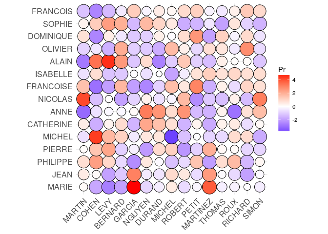

Independance first and last Names
================
Arthur Charpentier & Baptiste Coulmont
July 2017

Here we need to extend the correlation plot, where values are in the interval \[ − 1, +1\] to geta function where values are on the real line, following a Gaussian distribution (if components are independent)

``` r
ggcorrplot2 <- function(x, method = c("square", "circle"),
         outline_colour = "gray",
         colours = c("blue", "white", "red"),
         legend_title = "Pr",
         ggtheme = ggplot2::theme_minimal,
         title = "",
         tl.cex = 12, 
         tl.col = "black", tl.srt = 45,
         show_legend = TRUE){
  
  method <- match.arg(method)
  
  corr <- reshape2::melt(x, na.rm = TRUE)
  corr <- corr %>% 
    mutate(value_norm = 2*(pnorm(corr$value))-1,
           value_norm_abs = abs(value_norm),
           Var1_f = as.numeric(factor(Var1)),
           Var2_f = as.numeric(factor(Var2)))
  
  x_labs <- 
    corr %>% 
    select(Var1, Var1_f) %>% 
    unique()
  
  y_labs <- 
    corr %>% 
    select(Var2, Var2_f) %>% 
    unique()
  
  # La base du graphique
  p <- ggplot(corr, aes(x = factor(Var1_f), y = factor(Var2_f), fill = value))
  
  if (method == "square")
    p <- p + geom_tile(colour = outline_colour)
  else if(method == "circle") {
    p <- p + 
      geom_point(aes(size = value_norm_abs), shape = 21) +
      scale_size(range = c(4, 10)) +
      guides(size = FALSE)
  }

  
   p <- 
    p + scale_fill_gradient2(low = colours[1], high = colours[3], 
                           mid = colours[2], midpoint = 0,
                           space = "Lab", 
                           name = legend_title) +
    ggtheme() +
    theme(axis.text.x = element_text(angle = tl.srt, 
                                     vjust = 1, 
                                     size = tl.cex, 
                                     hjust = 1),
          axis.text.y = element_text(size = tl.cex)) + 
    coord_fixed() + 
    xlab(NULL) + ylab(NULL) +
    scale_x_discrete(breaks = x_labs$Var1_f, labels = x_labs$Var1) +
    scale_y_discrete(breaks = y_labs$Var2_f, labels = y_labs$Var2)
  
  if (title != "") 
    p <- p + ggtitle(title)
  
  if (!show_legend) 
    p <- p + theme(legend.position = "none")
   p
}
```

Let us import the datasets from our local drive

``` r
cpttf_t <- NULL
cpttl_t <- NULL
cpttot_t <- NULLcpttf_c_t <- NULL
cpttl_c_t <- NULL
cpttot_c_t <- NULL
setwd("/home/arthur/Dropbox/Dropbox (Télécom SudParis)/homonymes")
data=read.csv("tout.csv",sep=";")
#cpttf <- count(data, wt="PRENOM1")
#cpttl <- count(data, "NOM")
#cpttf <- count(cpttf, "PRENOM1, wt_var = "freq")
#cpttl <-count(cpttl, "NOM", wt_var = "freq")
#cpttf <- arrange(cpttf, desc(n))
#cpttl <- arrange(cpttl, desc(n))
cpttl <- aggregate(data$ARR,by=list(data$NOM),FUN=length)
cpttl <- cpttl[order(cpttl$x,decreasing=TRUE),]
cpttf <- aggregate(data$ARR,by=list(data$PRENOM1),FUN=length)
cpttf <- cpttf[order(cpttf$x,decreasing=TRUE),]
names(cpttl)=c("NOM","freq")
names(cpttf)=c("PRENOM1","freq")
k=15
LP=cpttf[1:(k),]
LN=cpttl[1:(k),]
countnp <- Vectorize(function(x,y){
  sum( (data$NOM==LN$NOM[x])&(data$PRENOM1==LP$PRENOM1[y]))
})
MAT=outer(1:k,1:k,countnp)
rownames(MAT)=LN$NOM
colnames(MAT)=LP$PRENOM1
```

Use here a chi-square test to test independence betweem first and last names, on the *k* = 15 most popular ones (only)

``` r
Q=chisq.test(MAT)
Q
```

    ## 
    ##  Pearson's Chi-squared test
    ## 
    ## data:  MAT
    ## X-squared = 460.09, df = 196, p-value < 2.2e-16

``` r
Q$observed
```

    ##          MARIE JEAN PHILIPPE PIERRE MICHEL CATHERINE ANNE NICOLAS
    ## MARTIN      79   84       50     37     37        38   15      57
    ## COHEN       19   29       25     18     30         7    9       8
    ## LEVY        14   18       19     20     20        13   10      12
    ## BERNARD     31   37       21     16     27        23   16      11
    ## GARCIA      57   49        9     14     15         9   13      11
    ## NGUYEN      13   15       11      2     10        13   14       8
    ## DURAND      37   37       22     22     23        24   25      15
    ## MICHEL      36   39       14     20      2        18   16      14
    ## ROBERT      31   39       17      8     13        10   23      22
    ## PETIT       32   30       25     12     17        16    8       6
    ## MARTINEZ    51   45       10     22     13         8    7      10
    ## THOMAS      29   31       21     15     13        15   13       9
    ## ROUX        36   34       29     18     23        19    4      18
    ## RICHARD     39   29       16     15     24        15   18      12
    ## SIMON       28   30       18     11      9        14   17      24
    ##          FRANCOISE ISABELLE ALAIN OLIVIER DOMINIQUE SOPHIE FRANCOIS
    ## MARTIN          46       29    22      28        35     30       21
    ## COHEN            3       14    25      10         3     14        2
    ## LEVY             6        7    28       6        12     17        5
    ## BERNARD         28       13    31      26        15     23       13
    ## GARCIA           8       13    11      10         9      7       15
    ## NGUYEN           1        5    10       4         4     10        5
    ## DURAND          15       16     8      10        17     18       15
    ## MICHEL          22        7    12      20        13     14       12
    ## ROBERT          19       13    22      16        17      7       15
    ## PETIT           27       16    12      11        22      7       15
    ## MARTINEZ         9       17    10      16         6     10       10
    ## THOMAS          16       15    16      15        16      5        9
    ## ROUX            15       19    18      14        14     16       14
    ## RICHARD         23       19    19      27        19     11       18
    ## SIMON           17       15    10      10        10      6       13

``` r
Q$expected
```

    ##             MARIE     JEAN  PHILIPPE    PIERRE    MICHEL CATHERINE
    ## MARTIN   78.18613 80.24365 45.118685 36.741600 40.562727 35.565869
    ## COHEN    27.77665 28.50761 16.029007 13.052937 14.410442 12.635243
    ## LEVY     26.61929 27.31980 15.361131 12.509065 13.810007 12.108774
    ## BERNARD  42.56514 43.68528 24.562968 20.002417 22.082669 19.362340
    ## GARCIA   32.14890 32.99492 18.552091 15.107566 16.678753 14.624124
    ## NGUYEN   16.07445 16.49746  9.276045  7.553783  8.339376  7.312062
    ## DURAND   39.09306 40.12183 22.559343 18.370800 20.281363 17.782934
    ## MICHEL   33.30626 34.18274 19.219966 15.651438 17.279188 15.150592
    ## ROBERT   34.97800 35.89848 20.184675 16.437032 18.146483 15.911047
    ## PETIT    32.92047 33.78680 18.997341 15.470147 17.079043 14.975103
    ## MARTINEZ 31.37733 32.20305 18.106841 14.744984 16.278463 14.273145
    ## THOMAS   30.60575 31.41117 17.661591 14.382403 15.878173 13.922166
    ## ROUX     37.42132 38.40609 21.594634 17.585207 19.414068 17.022480
    ## RICHARD  39.09306 40.12183 22.559343 18.370800 20.281363 17.782934
    ## SIMON    29.83418 30.61929 17.216340 14.019821 15.477883 13.571187
    ##               ANNE   NICOLAS FRANCOISE  ISABELLE     ALAIN   OLIVIER
    ## MARTIN   30.569011 34.831037 37.476432 32.038675 37.329466 32.773507
    ## COHEN    10.860044 12.374184 13.313996 11.382161 13.261784 11.643220
    ## LEVY     10.407542 11.858593 12.759246 10.907904 12.709210 11.158086
    ## BERNARD  16.642011 18.962292 20.402466 17.442108 20.322456 17.842156
    ## GARCIA   12.569495 14.321972 15.409717 13.173797 15.349287 13.475949
    ## NGUYEN    6.284747  7.160986  7.704859  6.586899  7.674643  6.737974
    ## DURAND   15.284506 17.415518 18.738216 16.019338 18.664733 16.386754
    ## MICHEL   13.021997 14.837563 15.964467 13.648054 15.901861 13.961083
    ## ROBERT   13.675610 15.582306 16.765772 14.333092 16.700024 14.661832
    ## PETIT    12.871163 14.665700 15.779550 13.489969 15.717670 13.799372
    ## MARTINEZ 12.267827 13.978245 15.039884 12.857626 14.980904 13.152526
    ## THOMAS   11.966159 13.634518 14.670051 12.541455 14.612521 12.829103
    ## ROUX     14.630892 16.670776 17.936911 15.334300 17.866570 15.686004
    ## RICHARD  15.284506 17.415518 18.738216 16.019338 18.664733 16.386754
    ## SIMON    11.664491 13.290790 14.300218 12.225284 14.244138 12.505680
    ##          DOMINIQUE    SOPHIE  FRANCOIS
    ## MARTIN   31.156877 28.658448 26.747885
    ## COHEN    11.068891 10.181291  9.502538
    ## LEVY     10.607687  9.757070  9.106599
    ## BERNARD  16.962050 15.601885 14.561760
    ## GARCIA   12.811216 11.783901 10.998308
    ## NGUYEN    6.405608  5.891951  5.499154
    ## DURAND   15.578438 14.329224 13.373942
    ## MICHEL   13.272420 12.208122 11.394247
    ## ROBERT   13.938603 12.820885 11.966159
    ## PETIT    13.118685 12.066715 11.262267
    ## MARTINEZ 12.503747 11.501088 10.734349
    ## THOMAS   12.196277 11.218274 10.470389
    ## ROUX     14.912255 13.716461 12.802030
    ## RICHARD  15.578438 14.329224 13.373942
    ## SIMON    11.888808 10.935460 10.206430

The plot is here

``` r
ggcorrplot2(Q$stdres, method = "circle")
```


