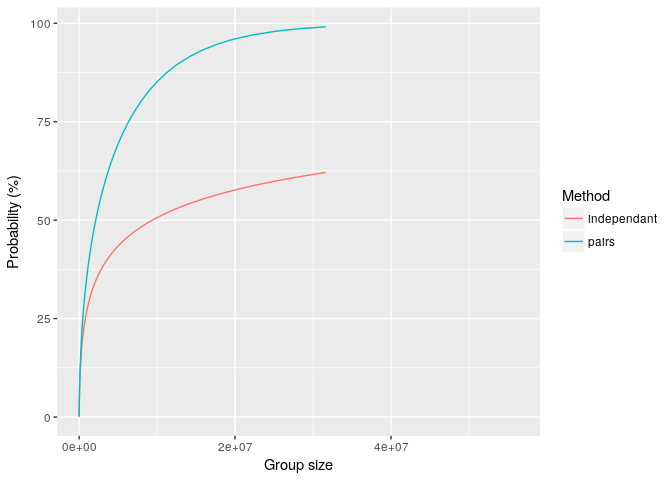
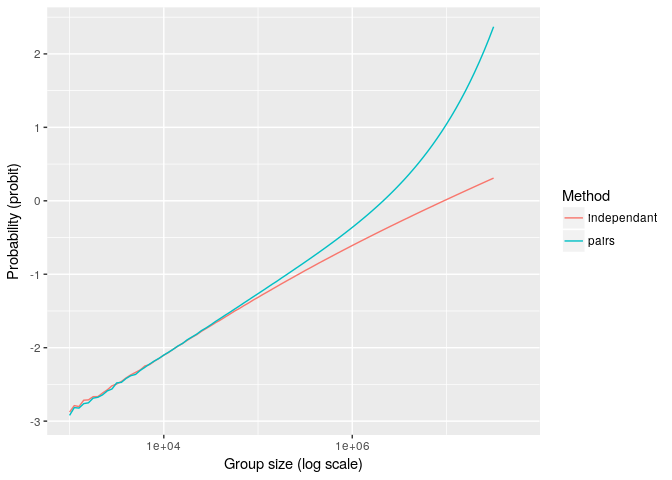
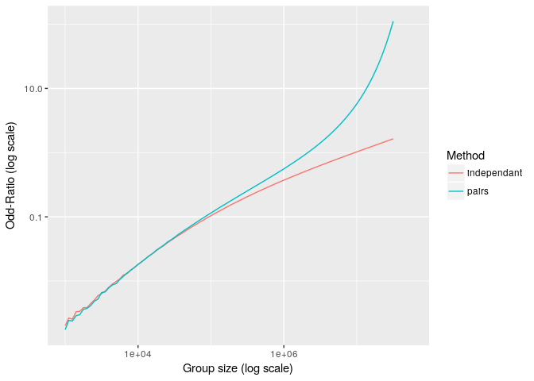
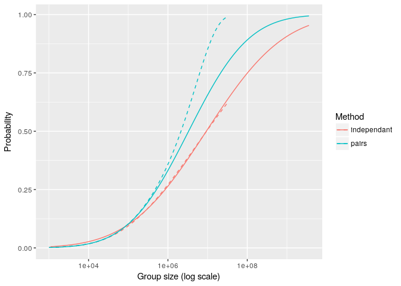

Homonyms, Ohio Names, statics
================
Arthur Charpentier & Baptiste Coulmont
July 2017

We can load the dataset, and use codes very similar to those used on French data

``` r
setwd("/home/arthur/Dropbox/Dropbox (Télécom SudParis)")
load("ohio.Rdata")

PROPORTION=function(taille){
  i1=sample(1:nrow(df),size=taille,replace=TRUE)
  i2=sample(1:nrow(df),size=taille,replace=TRUE)
  paire=paste(df$FIRST_NAME[i1],df$LAST_NAME[i1],sep="-")
  X=table(paire)
  proportion1= sum(X[X>1])/taille
  paire=paste(df$FIRST_NAME[i1],df$LAST_NAME[i2],sep="-")
  X=table(paire)
  proportion2= sum(X[X>1])/taille
  return(c(proportion1,proportion2))
}

SIMPROP=function(taille,n=100){
  M=Vectorize(PROPORTION)(rep(taille,n))
  apply(M,1,mean)
}
t=round(10^(seq(3,7.75,by=.05)))  
M=matrix(NA,length(t),2)
#for(i in 1:(length(t))){
#  M[i,]=SIMPROP(t[i])
#}
#save(M,file="ohio.RData")
#base=data.frame(y1=M[,1],y2=M[,2],x=t)
```

Again, in order to save some time, files are located on a local folder (and are not publicaly available)

``` r
setwd("/home/arthur/Dropbox/Dropbox (Télécom SudParis)/homonymes/homonymes/")
loc="baptiste_ohio_complet_base.RData"
load(file=loc)
t=base$x
M=base[,1:2]

library(ggplot2)
base=data.frame(Taille=rep(t,2),
                proportion=c(M[,1],M[,2])*100,
                Method=c(rep("pairs",length(t)),rep("independant",length(t))))
g1=ggplot(base,aes(Taille,proportion, group=Method, colour=Method))+geom_path()+
  xlab("Group size")+ylab("Probability (%)")
g1
```

    ## Warning: Removed 10 rows containing missing values (geom_path).



``` r
library(ggplot2)
base=data.frame(Taille=rep(t,2),
                proportion=qnorm(c(M[,1],M[,2])),
                Method=c(rep("pairs",length(t)),rep("independant",length(t))))
g2=ggplot(base,aes(Taille,proportion, group=Method, colour=Method))+geom_path()+scale_x_log10()+
  xlab("Group size (log scale)")+ylab("Probability (probit)")
g2
```

    ## Warning: Removed 10 rows containing missing values (geom_path).



``` r
library(ggplot2)
base=data.frame(Taille=rep(t,2),
                proportion=(c(M[,1],M[,2]))/(1-c(M[,1],M[,2])),
                Method=c(rep("pairs",length(t)),rep("independant",length(t))))
g3=ggplot(base,aes(Taille,proportion, group=Method, colour=Method))+geom_path()+scale_x_log10()+scale_y_log10()+
  xlab("Group size (log scale)")+ylab("Odd-Ratio (log scale)")
g3
```

    ## Warning: Removed 10 rows containing missing values (geom_path).



``` r
ggsave("g3-ohio.pdf",g3)
```

    ## Saving 7 x 5 in image

    ## Warning: Removed 10 rows containing missing values (geom_path).

``` r
base0=data.frame(y1=M[,1],y2=M[,2],x=t)
reg2=lm(qnorm(y2)~log(x),data=base0,subset=40:90)


id=15:35
reg1=lm(qnorm(y1)~log(x),data=base0,subset=id)
a1=reg1$coefficients
u=exp(seq(7,22,by=.01))
y1=(a1[1]+a1[2]*log(u))
base1=data.frame(Taille=u,proportion=y1)


a1=reg1$coefficients
a2=reg2$coefficients
u=exp(seq(7,22,by=.01))
y1=(a1[1]+a1[2]*log(u))
y2=(a2[1]+a2[2]*log(u))
base12=data.frame(Taille=rep(u,2),
                proportion=c(y1,y2),
                Method=c(rep("pairs",length(y1)),rep("indépendent",length(y2))))


base=data.frame(Taille=rep(t,2),
                proportion=qnorm(c(M[,1],M[,2])),
                Method=c(rep("pairs",length(t)),rep("independant",length(t))))
g2b=ggplot(base,aes(Taille,proportion, group=Method, colour=Method))+geom_line(linetype=2)+scale_x_log10()+
  xlab("Group size (log scale)")+ylab("Probability (probit)")
g2b=g2b+geom_line(aes(Taille,proportion, group=Method, colour=Method), data=base[c(id,length(t)+id),], size=2)
g2b=g2b+geom_line(aes(Taille,proportion, group=Method, colour=Method), data=base12)+ geom_vline(xintercept = t[range(id)],linetype = "longdash",col="grey")
g2b
```

    ## Warning: Removed 10 rows containing missing values (geom_path).


``` r
base=data.frame(Taille=rep(t,2),
                proportion=((c(M[,1],M[,2]))),
                Method=c(rep("pairs",length(t)),rep("independant",length(t))))
base12=data.frame(Taille=rep(u,2),
                proportion=pnorm(c(y1,y2)),
                Method=c(rep("pairs",length(y1)),rep("independant",length(y2))))
g3b=ggplot(base,aes(Taille,proportion, group=Method, colour=Method))+geom_line(linetype=2)+scale_x_log10()+
  xlab("Group size (log scale)")+ylab("Probability")
g3b=g3b+geom_line(aes(Taille,proportion, group=Method, colour=Method), data=base12)
g3b
```

    ## Warning: Removed 10 rows containing missing values (geom_path).


