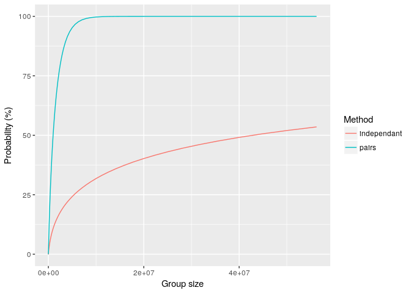
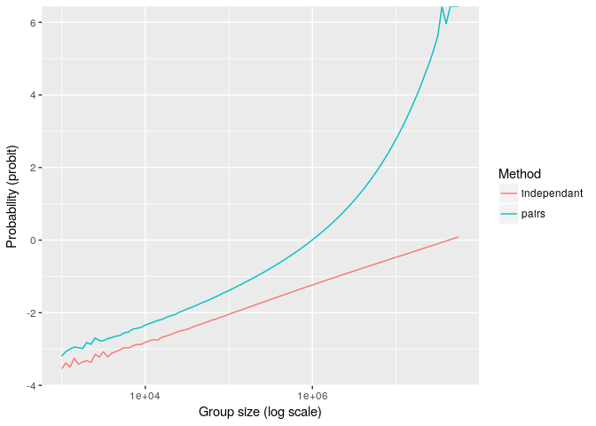
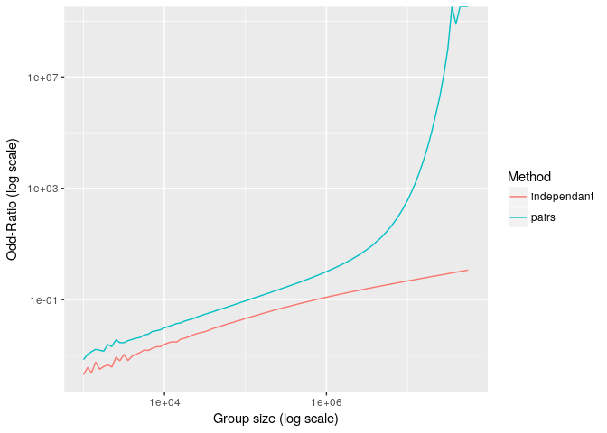
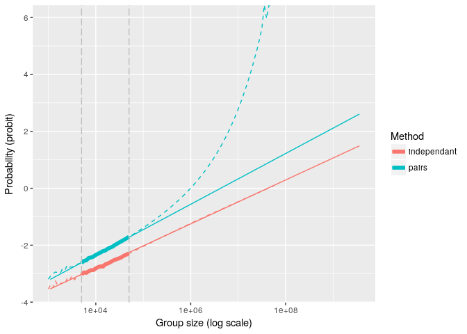
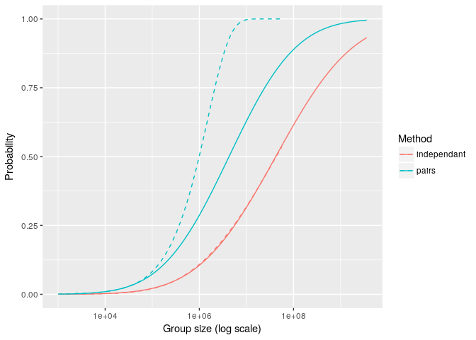

Homonyms, French Names, statics
================
Arthur Charpentier & Baptiste Coulmont
July 2017

The first step is to load the dataset

``` r
cpttf_t <- NULL
cpttl_t <- NULL
cpttot_t <- NULL
NULLcpttf_c_t <- NULL
cpttl_c_t <- NULL
cpttot_c_t <- NULL
setwd("/home/arthur/Dropbox/Dropbox (Télécom SudParis)/homonymes")
data=read.csv("tout.csv",sep=";")
```

then, we count

``` r
cpttf <- count(data, "PRENOM1")
cpttl <- count(data, "NOM")
cpttot <- count(data, c("NOM", "PRENOM1"))
cpttf <- count(cpttf, "PRENOM1", wt_var = "freq")
cpttl <-count(cpttl, "NOM", wt_var = "freq")
cpttot <- count(cpttot, c("NOM",  "PRENOM1"), wt_var = "freq")
cpttf <- arrange(cpttf, desc(freq))
cpttl <- arrange(cpttl, desc(freq))
cpttot <- arrange(cpttot, desc(freq))
```

Let us keepthe first *k* = 4, 000 first and last names (and we remove some typo)

``` r
k=4000
LP=cpttf[1:(k*1.1),]
LN=cpttl[1:(k*1.1),]
idx=LN$NOM%in%c("1er ARRONDISSEMENT","2eme ARRONDISSEMENT","3eme ARRONDISSEMENT","4eme ARRONDISSEMENT","5eme ARRONDISSEMENT","6eme ARRONDISSEMENT","7eme ARRONDISSEMENT","8eme ARRONDISSEMENT","9eme ARRONDISSEMENT","10eme ARRONDISSEMENT","11eme ARRONDISSEMENT","12eme ARRONDISSEMENT","13eme ARRONDISSEMENT","14eme ARRONDISSEMENT","15eme ARRONDISSEMENT","16eme ARRONDISSEMENT","17eme ARRONDISSEMENT","18eme ARRONDISSEMENT","19eme ARRONDISSEMENT","20eme ARRONDISSEMENT","Révision 2015",""," ")
if(length(which(idx))>0) LN=LN[-which(idx),]
LN=LN[1:k,]
idx=LP$PRENOM1%in%c("645",""," ")
if(length(which(idx))>0) LP=LP[-which(idx),]
LP=LP[1:k,]
BPN=cpttot
idx=BPN$NOM%in%c("1er ARRONDISSEMENT","2eme ARRONDISSEMENT","3eme ARRONDISSEMENT","4eme ARRONDISSEMENT","5eme ARRONDISSEMENT","6eme ARRONDISSEMENT","7eme ARRONDISSEMENT","8eme ARRONDISSEMENT","9eme ARRONDISSEMENT","10eme ARRONDISSEMENT","11eme ARRONDISSEMENT","12eme ARRONDISSEMENT","13eme ARRONDISSEMENT","14eme ARRONDISSEMENT","15eme ARRONDISSEMENT","16eme ARRONDISSEMENT","17eme ARRONDISSEMENT","18eme ARRONDISSEMENT","19eme ARRONDISSEMENT","20eme ARRONDISSEMENT","Révision 2015",""," ")
BPN=BPN[-which(idx),]
idx=BPN$PRENOM1%in%c("645",""," ")
BPN=BPN[-which(idx),]
LPN=BPN[(BPN$NOM %in% LN$NOM) & (BPN$PRENOM1 %in% LP$PRENOM1),]
rm(list=c("idx","data","temp"))
```

    ## Warning in rm(list = c("idx", "data", "temp")): objet 'temp' introuvable

Now we have clean data. The first function generate sample of given size *n*, either by drawing a pair first and last name from the original sample, or by drawing independently a first name, and a last name.

``` r
PROPORTION=function(taille){
 # version tirage couple
 i=sample(1:nrow(BPN),size=taille,replace=TRUE,prob=BPN$freq)
 X=table(i)
 proportion1= sum(X[X>1])/taille
 # version tirage nom/prenom
 i1=sample(1:nrow(BPN),size=taille,replace=TRUE,prob=BPN$freq)
 i2=sample(1:nrow(BPN),size=taille,replace=TRUE,prob=BPN$freq)
 paire=paste(BPN$NOM[i1],BPN$PRENOM1[i2],sep="-")
 X=table(paire)
 proportion2= sum(X[X>1])/taille
 ##
 return(c(proportion1,proportion2))
}
```

The output is the proportion of people with an alter-ego, out of *n* people, in one simulation, with two values (according to the two techniques). Then we have the following function that generates many samples, and return the average proportion,

``` r
SIMPROP=function(taille,n=20){
  M=Vectorize(PROPORTION)(rep(taille,n))
  apply(M,1,mean)
}
```

Let us run simulations, for various sample sizes, fromone thousand (1e3) to 60 millions (10e7.75),

``` r
t=round(10^(seq(3,7.75,by=.25)))  
M=matrix(NA,length(t),2)
set.seed(1)
#for(i in 1:(length(t)-6)){
#   M[i,]=SIMPROP(t[i])
#}
#save(M,file="simu1.RData")
#base=data.frame(y1=M[,1],y2=M[,2],x=t)
#save(base,file="simu2.RData")
```

Unfortunately, it is quite long. Thus, for the githug file, let us load an .RData file

``` r
rm(list=ls())
loc="/home/arthur/Dropbox/Dropbox (Télécom SudParis)/homonymes/baptiste_simu2ter.RData"
load(file=loc)
t=base$x
M=base[,1:2]
```

Then we can plot some graphs

``` r
library(ggplot2)
base=data.frame(Taille=rep(t,2),
                proportion=c(M[,1],M[,2])*100,
                Method=c(rep("pairs",length(t)),rep("independant",length(t))))
g1=ggplot(base,aes(Taille,proportion, group=Method, colour=Method))+geom_path()+
  xlab("Group size")+ylab("Probability (%)")
g1
```



Instead of visualizing the proportion, as a function of *n*, consider for the *x*-axis the logarithm of *n*, and for the *y*-axis a *probit* transform, i.e. *Φ*<sup>−1</sup>(⋅), where *Φ*(⋅) is the c.d.f of the 𝒩(0, 1) distribution

``` r
library(ggplot2)
base=data.frame(Taille=rep(t,2),
                proportion=qnorm(c(M[,1],M[,2])),
                Method=c(rep("pairs",length(t)),rep("independant",length(t))))
g2=ggplot(base,aes(Taille,proportion, group=Method, colour=Method))+geom_path()+scale_x_log10()+
  xlab("Group size (log scale)")+ylab("Probability (probit)")
g2
```



An alternative, instead of a *probit* transform is to consider a *logit* transform, i.e. the logarithm of the *odds-ratio*, $\\displaystyle{\\frac{\\mathbb{P}\[\\text{homonymes}\]}{1-\\mathbb{P}\[\\text{homonymes}\]}}$, on a log scale

``` r
library(ggplot2)
base=data.frame(Taille=rep(t,2),
                proportion=(c(M[,1],M[,2]))/(1-c(M[,1],M[,2])),
                Method=c(rep("pairs",length(t)),rep("independant",length(t))))
g3=ggplot(base,aes(Taille,proportion, group=Method, colour=Method))+geom_path()+scale_x_log10()+scale_y_log10()+
  xlab("Group size (log scale)")+ylab("Odd-Ratio (log scale)")
g3
```



We have a linear model with the *probit* transform, when we assume independence between the **first name** and the **last name**,

``` r
base0=data.frame(y1=M[,1],y2=M[,2],x=t)
reg2=lm(qnorm(y2)~log(x),data=base0)
```

We can use this model to get predictions

``` r
id=15:35
reg1=lm(qnorm(y1)~log(x),data=base0,subset=id)
a1=reg1$coefficients
u=exp(seq(7,22,by=.01))
y1=(a1[1]+a1[2]*log(u))
base1=data.frame(Taille=u,proportion=y1)
```

and extrapolations, with a similar pattern, since, when *n* is between 8,000 and 200,000 the two curves are approximately *linear*

``` r
a1=reg1$coefficients
a2=reg2$coefficients
u=exp(seq(7,22,by=.01))
y1=(a1[1]+a1[2]*log(u))
y2=(a2[1]+a2[2]*log(u))
base12=data.frame(Taille=rep(u,2),
                proportion=c(y1,y2),
                Method=c(rep("pairs",length(y1)),rep("independant",length(y2))))
```

We can also use that linear model to extrapolate

``` r
base=data.frame(Taille=rep(t,2),
                proportion=qnorm(c(M[,1],M[,2])),
                Method=c(rep("pairs",length(t)),rep("independant",length(t))))
g2b=ggplot(base,aes(Taille,proportion, group=Method, colour=Method))+geom_line(linetype=2)+scale_x_log10()+
  xlab("Group size (log scale)")+ylab("Probability (probit)")
g2b=g2b+geom_line(aes(Taille,proportion, group=Method, colour=Method), data=base[c(id,length(t)+id),], size=2)
g2b+geom_line(aes(Taille,proportion, group=Method, colour=Method), data=base12)+ geom_vline(xintercept = t[range(id)],linetype = "longdash",col="grey")
```



Back on the probability scale, we get

``` r
base=data.frame(Taille=rep(t,2),
                proportion=((c(M[,1],M[,2]))),
                Method=c(rep("pairs",length(t)),rep("independant",length(t))))
base12=data.frame(Taille=rep(u,2),
                proportion=pnorm(c(y1,y2)),
                Method=c(rep("pairs",length(y1)),rep("independant",length(y2))))
g3b=ggplot(base,aes(Taille,proportion, group=Method, colour=Method))+geom_line(linetype=2)+scale_x_log10()+
  xlab("Group size (log scale)")+ylab("Probability")
g3b+geom_line(aes(Taille,proportion, group=Method, colour=Method), data=base12)
```


